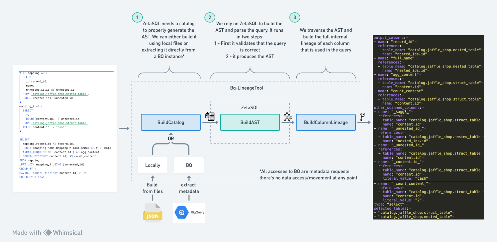

# Bq-Lineage-tool


Bq-lineage tool is a column level lineage parser for BigQuery using ZetaSQL. This 
parser started as a fork of this [project by google](https://github.com/GoogleCloudPlatform/bigquery-data-lineage), but it
has been heavily modified to cover the whole bigquery syntax offered by ZetaSQL. The
output of this parser is a DAG of the columns used in a query from sources to outputs, including
auxiliary fields that could be used as part of filters or other operations that don't result in the
materialisation of a field. 


From any arbitrary BigQuery query, you will get the following outputs:
- `output_columns`: The columns that are part of the output of the query, with all the input 
  columns references that were needed to produce them.
- `Other_scanned_columns`: Some columns are only used in filters, joins... these columns might 
  never be end up being part of the output of the query, but they are still used in the query. 
  A list of all these columns will be also part of the output of the parser with the respected input references. Note that this list 
  might have duplicates, as the same column might be used in multiple operations.
- `selected_tables`: A list of all the tables that were selected in the query.
- `Type`: The type of sql statement `{SELECT, CREATE_VIEW, MERGE...}`




## What can this parser do?

* It's schema aware. This means that a query like `SELECT * FROM table` will generate a DAG
  with all the output columns of `table`, and not just a single node with a `*` symbol.
* It prunes unused columns. This means that for a query like `WITH base AS (SELECT * FROM
  table) SELECT aColumn FROM base` the output DAG will only contain the column `aColumn` and not the
  whole input table.
* It covers pretty much all the BigQuery syntax, including:
    * `WITH` (CTE) clauses
    * Subqueries
    * `UNNEST`-based `JOINS`
    * `STRUCTS` and `ARRAYS`
    * `JOINS`
    * Analytical functions (`QUALIFY`, `LAG`/`LEAD`, `WINDOWS` etc.)
    * Map aliases to original columns
    * `JSON` functions
    * Access to the `PATH` used in `JSON` functions (`JSON_EXTRACT(field,"$.path.to.field")`)
    * Access to the literals used in the query, for example, in a `WHERE` clause
    * Access to fields that are not part of the output columns of the table (fields only used in a
      `WHERE` clause)
    * `PIVOT` and `UNPIVOT` transformations
    * `GROUP BY GROUPING SETS`, `ROLLUP` and `CUBE`
    * `UDF` and temporary functions
    * Usage of parameters @param
    * Recursive CTEs
    * It parses `SELECTS`, `CREATE {VIEWS}` and `MERGE` statements
    * It automatically infers internal BQ fields like `_TABLE_SUFFIX`

## What can't it do?

* This parser won't work with procedural SQL. For example, it will fail trying to parse a 
  DECLARE or SET operations.
* This parser won't read the logic within UDF functions. It only checks inputs and outputs.
* ZetaSQL might not be up-to-date with the latest BigQuery features, so if there's something
  super new, it will involve either waiting for ZetaSQL to be updated, or going deep into
  ZetaSQL to build the feature.
* It doesn't work while trying to parse queries accessing `INFORMATION_SCHEMA`-type of tables. I
  guess we could bypass this by using a different type of access, but never when through it deeply.
* This parser won't build the DAG of multiple queries. It only parses a single query at a
  time. To build a full dag of your dbt project, for example, you can use libraries like
  `networkx` to connect the edges from the output of this parser.
* Parse SQL syntax that is not supported by ZetaSQL (for example the + operator in Snowflake joins)
* When doing a `SELECT count(*) FROM table`, the output of the parser would act as if no columns
  were selected. This could be subject to interpretation: should all the columns of the input
  `table` be marked as used? Or should the output be an empty list because this query doesn't
  care about any specific column or number of columns?
* Unexpected bugs - even though this parser has been texted over more than 7000 SQL queries, 
  there still might be some edge cases that suddenly are not covered. SQL is hard.
* It doesn't work with `TVF` (Table Valued Functions) - although ZetaSQL parses it, the output 
  won't show the columns of the TVF.

## How to use
The folder `/src/test/examples` has multiple examples of how to use this parser. The main caveat 
relies on how to build the catalog that ZetaSQL needs. Depending on how much you want the parser 
to automate the whole process for you, there are three different methods to build a catalog, 
from the "let the parser to it for me" to "I'll build the catalog myself"

- `/src/test/examples/BigQuerySqlParserBQSchemaTest.java` shows how to rely on the metadata of 
  BiGQuery to build the catalog. To use this method the user has to be authenticated with gcloud.
  Note that there's zero data access/movement in this operation. The only access that is being 
  done is directly to the metadata of the tables, and only to the tables that are being used in 
  the parsed query, i.e., this parser won't scan the whole database. The access is done using 
  the bigquery API. You can use  `gcloud auth application-default login` to authenticate. 
- `/src/test/examples/BigQuerySqlParserLocalSchemaTest.java` shows how to use local json files 
  to build the schema. `/src/test/resources/schemas/` has examples of these files. They are 
  exact copies of the metadata information you can get 
[through the API](https://cloud.google.com/bigquery/docs/reference/rest/v2/tables). Note that 
  this is basically what we automate with the previous method.
- `/src/test/examples/ASTExplorerTest.java` Shows an example on how can manually create your own 
  catalog using ZetaSQL methods/constructors and feed it into the parser. 

### Example
The following example uses the first method to build the catalog -  it will use the bigquery API 
to request the metadata of the tables used in the query.
```java
    BigQueryZetaSqlSchemaLoader schemaLoader =
        new BigQueryZetaSqlSchemaLoader(
            BigQueryTableLoadService.usingServiceFactory(
                BigQueryServiceFactory.defaultFactory()
          )
        );

    ZetaSQLResolver parser = new ZetaSQLResolver(schemaLoader);
    
    String sql = """
        SELECT
              word,
              SUM(word_count) AS count
            FROM
              `bigquery-public-data.samples.shakespeare`
            WHERE
              word LIKE "%raisin%"
            GROUP BY
              word;
        """;
    
    ResolvedNodeExtended table = parser.extractLineage(sql);
    OutputLineage printer = new OutputLineage();
    printer.toYaml(table, "test", true);
```
Output:
```
name: "test"
output_columns:
- name: "word"
  references:
  - project_name: "bigquery-public-data.samples.shakespeare"
    column_name: "word"
- name: "count"
  references:
  - project_name: "bigquery-public-data.samples.shakespeare"
    column_name: "word_count"
other_scanned_columns:
- name: "_word_"
  references:
  - project_name: "bigquery-public-data.samples.shakespeare"
    column_name: "word"
    literal_value:
    - "%raisin%"
type: "select"
selected_tables:
- "bigquery-public-data.samples.shakespeare"
```

### Notes
- This parser **never** accesses the data of the tables or any bigquery instance. The only 
  connection needed is to the metadata of the tables.
- The parser will use a default project+dataset if these are missing in the reference tables of 
  a project. Please refer to `src/main/java/com/borjav/data/options/Options.java` in case you 
  need to set a specific project.
- When using UDFs, they also have to be defined within the code. The parser won't be able to 
  resolve them if they are not defined in the code. Please refer to 
  `src/test/resources/sql/benchmark/udf.yaml`.
